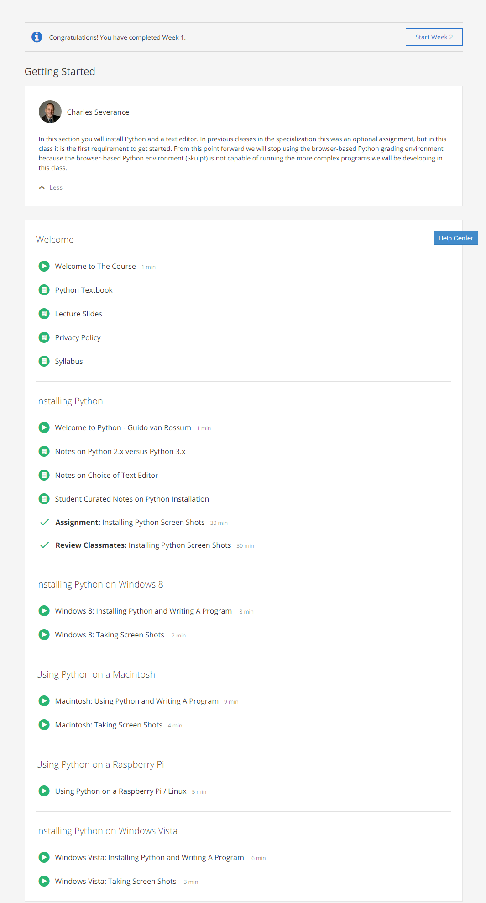

### Week 1: Getting Started

These are the contents of week 1:  

The content includes instructions about getting Python installed and running on your computer. 
There is also a simple assignment to demonstrate that Python has installed properly on your machine.

 

[Back to course notes](../Course_Notes.md)
